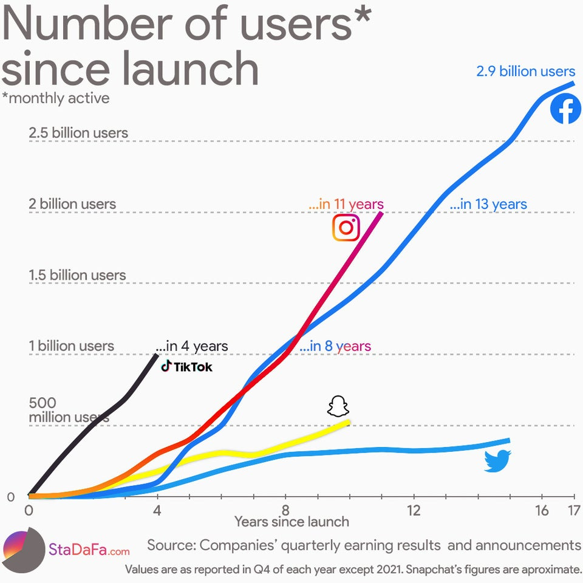

link: https://www.reddit.com/r/dataisbeautiful/comments/ssbk49/number_of_social_media_users_since_launch_oc/

As an avid social media user myself, I found this data visualization very intriguing. This visual was created using user growth of popular social media platforms, with the zero point on the X-axis being the moment they launched. It is also based on monthly active users (meaning people that use each service at least once a month). This data was gathered from each platform's respective earnings reports. It is strange to see that Twitter is one of the oldest platforms of those in the visual, yet has the least amount of growth in terms of users because I feel like I see tweets the most online in the news and whatnot. I'm also not surprised that Tiktok has the fastest user growth out of all the platforms in the shortest amount of time (that app is so addictive). I feel like a lot of the younger population is on Tiktok now, and because it's newer it completely exploded over the past couple of years. I would think it would be cool to see the age breakdown on each of these platforms, since I feel like a lot of older people are using Facebook versus Instagram and Snapchat. I'm excited to see the growth that Tiktok will have in the future and if it will continue to grow at a huge rate. I would also think it would be cool to see the ratio of inactive accounts to active accounts on each of the respective platforms since platforms with more accounts might have more active users. I would also like to see Tiktoks growth more accurately since it rebranded from Musical.ly in 2017, therefore not starting with 0 users 4 years ago.
