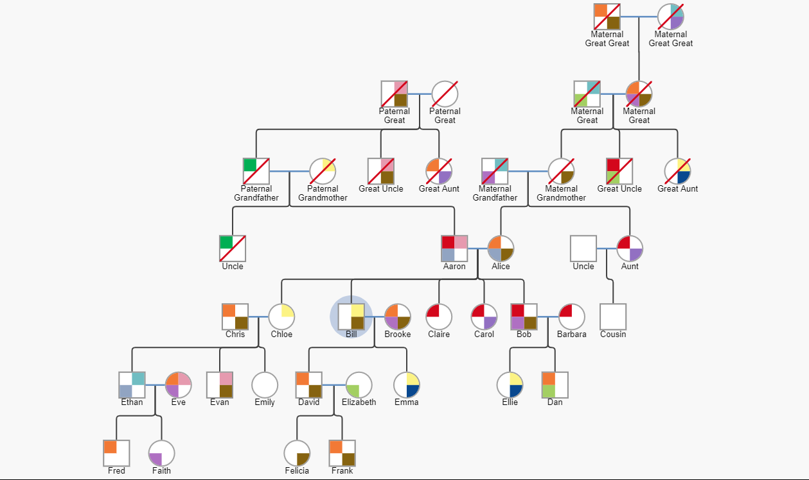

This first reflection concerns a piece of work that I did during a summer internship at Northwoods Software Corporation. My task for this internship was to use the GoJS library (https://gojs.net) to make a diagramming layout for genograms, or advanced family trees. 

Above is an example of the type of genogram that would be generated from this. The main issue in this project was scaling the visualization and visualizing trees that might consist of hundreds or thousands of nodes/people. This is a very difficult task, since visualizing large trees in the general case can get incredibly complicated incredibly fast.

I think this is a very interesting piece of work to showcase for the purposes of this class because it involves visualizing a fairly uncommon and unique type of data. Family trees aren't actually just trees all the time - they can become directed acyclic graphs in general, and this makes the visualization process even harder.

The layout is, of course, only one part of making a good genogram. Colors and shapes are also very important to the visualization, and luckily this is a much easier part of the project. This sample uses high-contrast colors and shapes to distinguish between genders and properties of people. Because genograms are often used to trace traits through a genaeology, this is an important part of the visualization as well.
