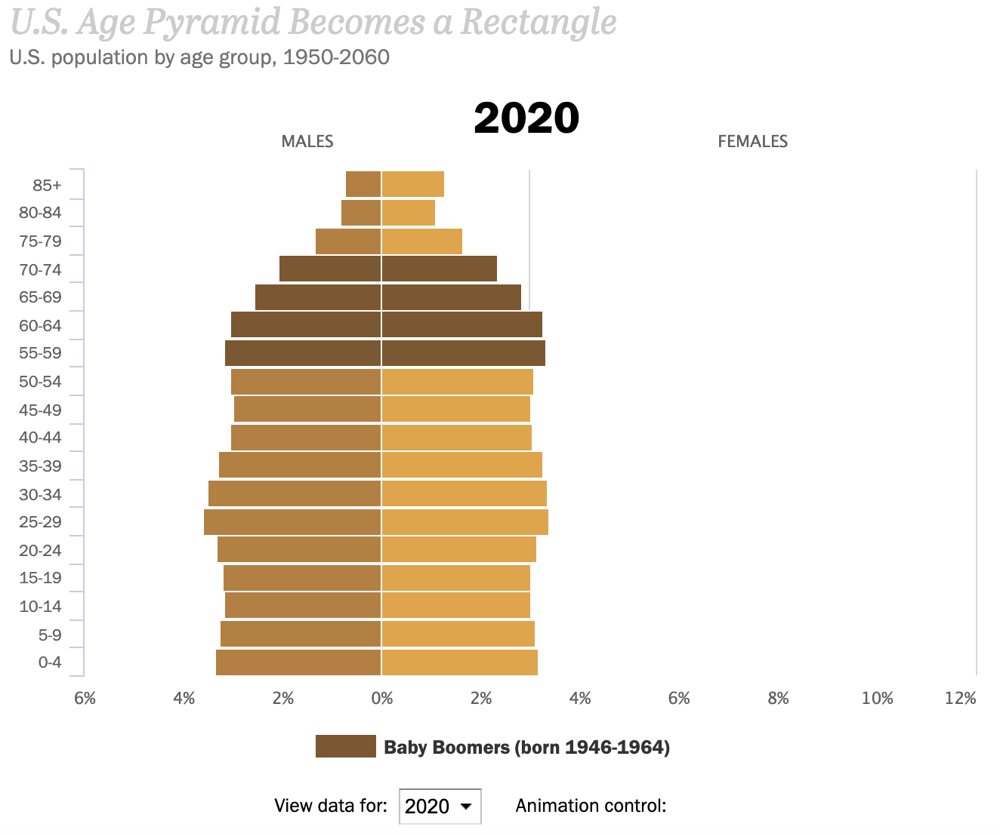

Source: https://www.pewresearch.org/next-america/#Two-Dramas-in-Slow-Motion

For this weeks reflection I was looking into the population of the United States in years to come. In which I found a bar chart data visualization that looks into the demographic data of the United States. The maker of this data visualization is the Pew Research Center which I think they did a excellent in making there data visualizations for "The Next America" article that they did. They have several different data visualizations on the website but the one that I mainly want to focus on is "U.S. Age Pyramid Becomes a Rectangle" which is the first on the article. The horizontal bar chart displays the percentage of the United States population for various age groups. You can select the year you would like to view however they increment every five years. 

For every age group it shows the percentage of the population for both males and females. When you select between the years for the graph it displays the new data with a clean and smooth transition animation which I believe is a very nice feature to have. Adding animations like this makes the website feel more interactive to the viewer. Looking at the horizontal bar graph more in depth now we can see that males and females have their own color to represent their own data on the graph. This is where I think they could've done better colors in my opinion like blue and pink to represent male and female respectively. However I get why the designers choose the colors that they did becuase they wanted to match the theme of their website. A very cool feature they added to the website is they have a animation control button where if you press it will animation through all of the years which I found very useful. This makes it easy for the user to view all of the data for all of the years without pressing each of years in the drop down box.

