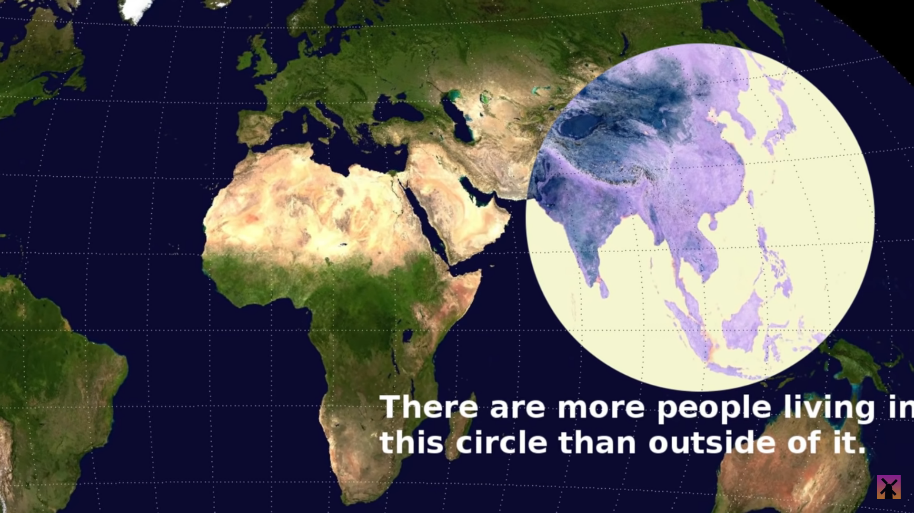
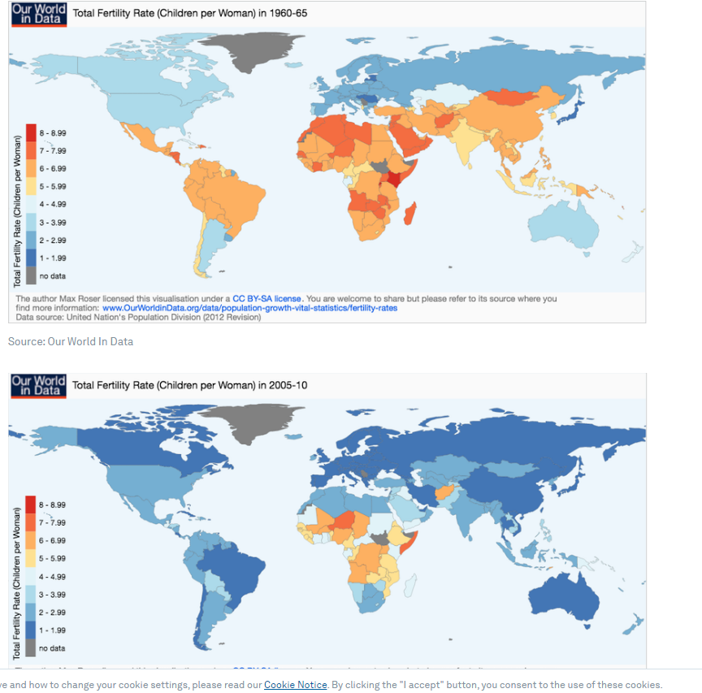

The data visualization I’ve reviewed this week comes from an article that includes multiple interesting visualizations relating to the growing global population and its overall distribution. Curiously, the article includes an image of the globe with a highlighted circle centering over southern China, northern India, and indonesia. I chose to include a more detailed visualization that contextualizes the aforementioned map by providing information about the birth rate in every nation worldwide. The map uses saturation on a blue-to-red scale to represent the average ratio of children to women in a given country. The saturation is an effective means of demonstrating the birth rate of each nation comparatively so that regional averages can be easily perceived. The visualization includes two maps that use this same key, one representing global averages taken from data collected from 1955-1960, while the other includes data collected from 2005-2010. Global averages taken 60-70 years ago provide logical explanations for the current population distribution, and the article includes these modern charts and averages to make predictions about the growing world population. For example, it can be observed between the two charts that while China still has a massive population, the birth rate has dropped dramatically, from 5+ children per woman to one, while India’s population continues to grow. Based on these visualizations, the article suggests India’s population will eclipse China’s within the next 10 years, and that the global population will rise to be nearly 10 billion by 2050. The chart could be improved by including the actual national average birth rate based on the ratio of women to children as this would provide more specific detail for comparison between the many countries that have an estimated birth rate of 1-1.99 children, as many more nations have moved toward this categorization in the more modern chart makes the current saturation scale somewhat irrelevant. 

(article : https://www.weforum.org/agenda/2017/07/more-people-live-inside-this-egg-than-outside-of-it-and-other-overpopulation-data/ )
