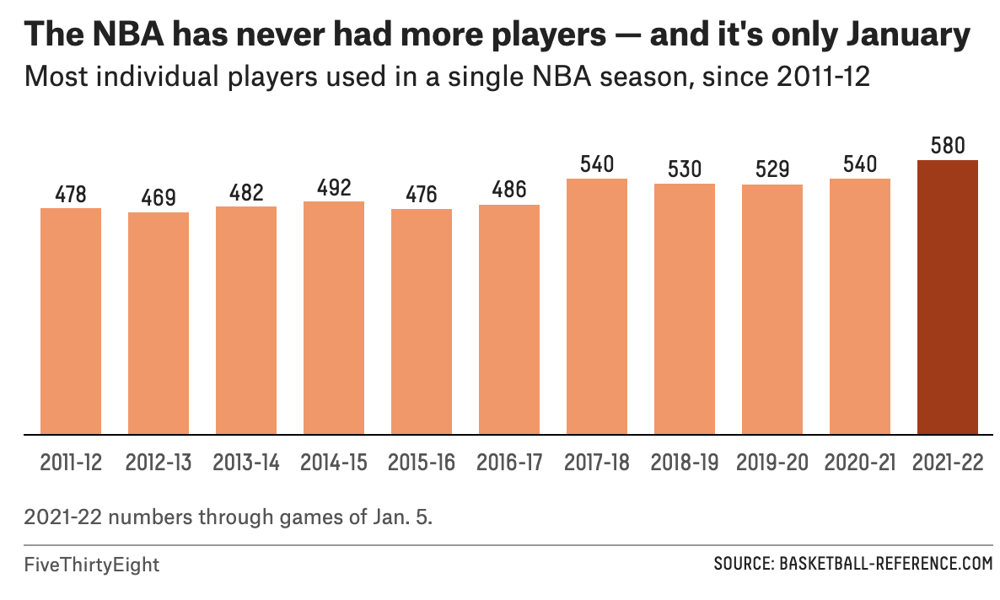

https://fivethirtyeight.com/features/how-omicron-has-reshaped-sports/ 
I have never heard of FiveThirtyEight before today, and find the website very cool. I am pretty into sports, so I explored the sports section of the website. One post that I find very relatable is How Omicron Has Reshaped Sports. In this article, author Neil Paine discusses many of the different changes in trends that we have seen in sports since omicron including the number of players on teams, unpredictability of results, and amount of scoring. Alone it is a very interesting article, but with visualizations throughout the article, the reader is able to understand and absorb more information. For example, one of the visualizations shows the Favorite’s Win Percent (how often favored teams actually win a game) over various years, and this year is split up. I find it helpful to see this difference, as it proves the point of the article that omicron has caused changes in some of the outcomes for sports. I do wonder if the difference in percentage could also be due to the fact that less games are taken into account when the season is split up into two different statistics.

Something that is interesting to me is that there are two graphs used to show that leagues have seen more scoring since omicron. These graphs show a line graph where a steep increase in scoring is seen right before omicron for the NBA and right after omicron for the NHL. It makes me wonder about other events going on during the time of the increase in scoring. Could it just be a coincidence? Why are we only talking specifically about omicron when it looks like the NBA sees an increase in scoring before omicron? And finally, I am very curious about the previous years, is this the most scoring ever, or has it just increased this year? Were more games played in a certain amount of time that could account for a surge or drop in scoring? Since this data is comparing the scoring in a sport to previous years, I feel like it would be helpful to also see that visualized, and not just written in the text.

Another thing that stood out to me is the first graph. It is a bar chart that shows the amount of players in the NBA for each season. I found it helpful that when you hover over a bar, the color changes. However, I noticed that the last bar, which is the current season, is a completely different color than the rest of the bars. I am used to seeing color maps that change shades slightly as the values for each data point change, but in this case, all of the other bars seem to be the same color. I am curious if the scaling of the color map only categorizes one bar into a dark orange, or if it is just used to show the maximum number.
