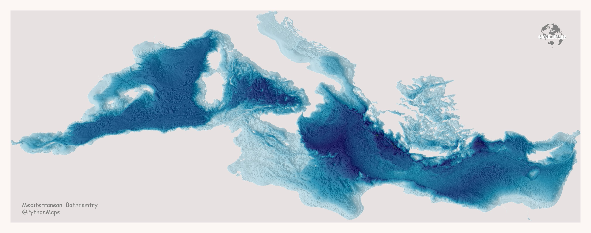

I knew data visualization as art was real, but I had never really seen one. Wondering through Twitter, I found this incredible example of data-vis as art. When I initially saw the image without context, I was confused. However, when I realized what it was about, it all made sense. I recognized Italy through its distinctive shape and then the island in front of it.

The color gradients are outstanding from an artistic and data visualization perspective. They easily allow seeing where the sea is deeper, patterns, and underwater mountains. Overall, I really like how the plot looks.

However, I think the author could have done a couple of things to improve this plot. First, there is no data source. The bottom left displays a title and creator, but there are no credits/sources for the data. I find this very important, as it gives the visualization authority. Second, I found it challenging to understand what I was looking at without context. I think adding names to the countries or at least continents without changing the background would make it a lot more understandable. Last, I think the author could have expanded the range of colors to make the dark blue even darker. 

Source: [Twitter](https://twitter.com/PythonMaps/status/1484245047793131521/photo/1)
