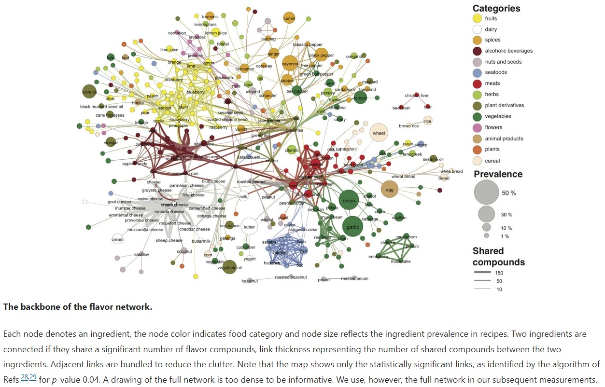
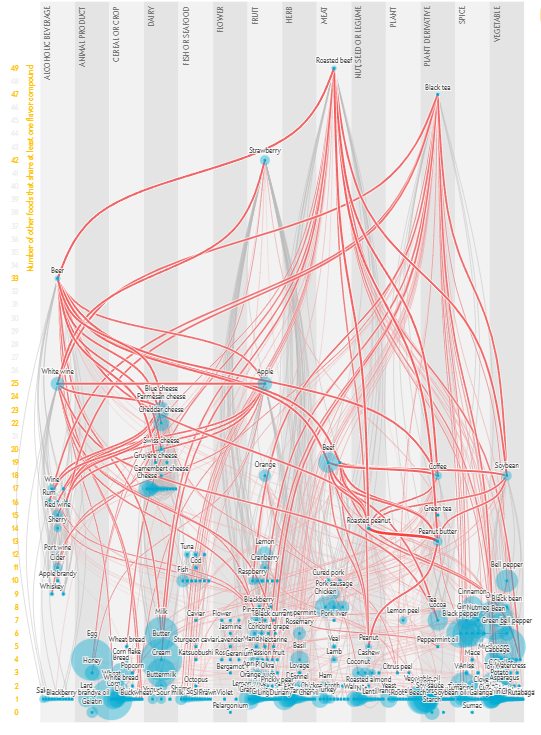

For my week 2 reflection I decided to focus on Figure 2 the 2011 paper [Flavor network and the principles of food pairing](https://www.nature.com/articles/srep00196) by Ahn et al. The first picture is the figure directly from the paper, and the second image is a screen shot of an [interactive version](https://www.scientificamerican.com/article/flavor-connection-taste-map-interactive/) publish by Scientific American in 2013. In the paper, the authors used codices of recipes from America and South Korea. Each ingredient in the recipes was mapped to all of the flavor compounds it contains. Initially, I had found this paper through the Scientific American's interactive visualization. Despite the builtin instructions, I found it hard to use because of the colors and size of the visualization. The yellow numbers on the right were easy to miss. Additionally the visualization did not label some of the ingredients especially in the lower columns which were very dense. It was also annoying that you could only select a row rather than individual ingredients. This was fine for rows that had only one ingredient, but very confusing otherwise. Because of these gripes, I decided to look at the paper itself. In Figure 2, ingredients are represented as nodes in a graph where the size of the node is the prevalence in recipes. The edges connect ingredients that share compounds with the thickness representing the number of shared compounds. The color of each area represents the food group. I really liked this version compared to the interactive one because it was easier to see the groups of food and the number of compounds shared. Additionally this graph was also physically larger and therefore easier to read. One thing that I did not lke was the density of each ingredient connections. Unlike the interactive graph where it was easy to see foods with lots of connections, it was actually the opposite in the paper figure. In the paper this figure was more exploratory since it informed the researchers' next direction while the interactive was expository. In both I feel like the biggest hurdle to usability was data density.
