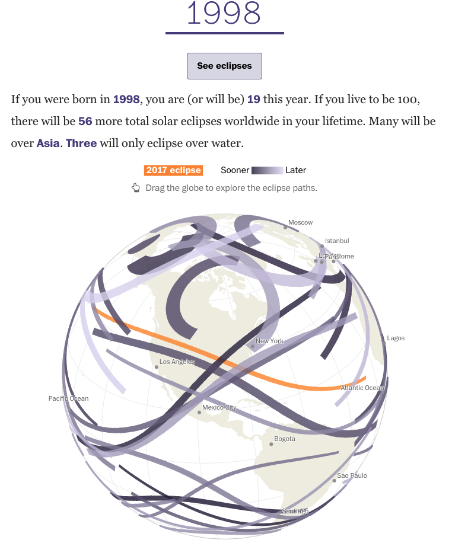

Source: https://www.washingtonpost.com/graphics/national/eclipse/

For this reflection I was interested in looking into Earth’s solar eclipses data visualization since it seems very interesting and hard to map out. The Washington Post article shows several different types of data visualizations of eclipses including eclipse paths over the past and future years, total eclipse paths over the United States, and the highest number of paths through a certain region of the United States. You can also input the year that you were born in, and it will tell/show you the eclipse that you will see eclipses that you will see in your lifetime. The data visualization even shows how the solar eclipses work and the difference between a partial eclipse and total eclipse.

The Washington Post also did a very good job of making a 3d interactive visualization shown below of solar eclipses over a wide spread of years. The 3d Earth globe being interactive also making the user experience a lot better. This allows the user to drag the globe to explore solar eclipse paths in every part of the world. It would have been interesting if they also made the globe zoom in and out kind of like Google Maps. They include a lot of more in depth analysis and pictures of only of the United States probably because most of their users are from the United States. 

