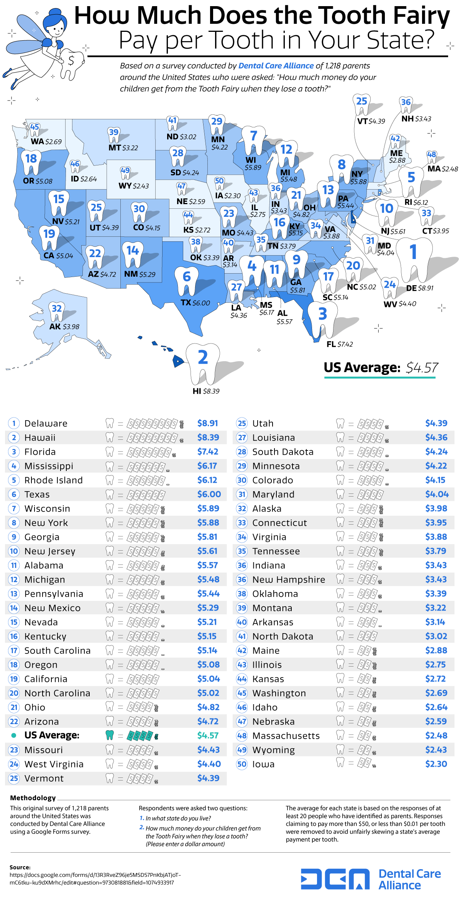

link: https://www.reddit.com/r/dataisbeautiful/comments/suoei2/how_much_the_tooth_fairy_pays_per_tooth_in_every/

As a now-adult, the concept of the tooth fairy is really fascinating to me. How did it start? This data visualization represents the average amount of money children recieve from the tooth fairy in each state. The data for this visual was from a study conducted by the Dental Care Alliance, where they asked 1,218 parents across the United States what state they live in and how much money their children get for losing a tooth. The larger the tooth in each state, the more money children get from the tooth fairy. I was shocked to see that in Delaware the average is almost $9! As a kid I only got around $5 from what I remember, and it was interesting to see that Massachusetts is one of the states with the lowest amount the tooth fairy gives out. I think it would be even more interesting if the study asked for even more data, such as what year their children were born to see how the amount has changed over the years (if it has). I know some people born in the 70s and 80s got less than a dollar from their tooth fairy, so I'd like to see how much it changed. It would also be helpful if the study included how many respondants it had from each state. It claims to have more than 20 for each state and values must have been between $0.01 and $50 so I would like to see the range of answers people gave to the questionnaire. Perhaps it would also be worthwhile to ask how many children are in the household to see if the amount changes if there are more/less children being visited by the tooth fairy in the home. 
