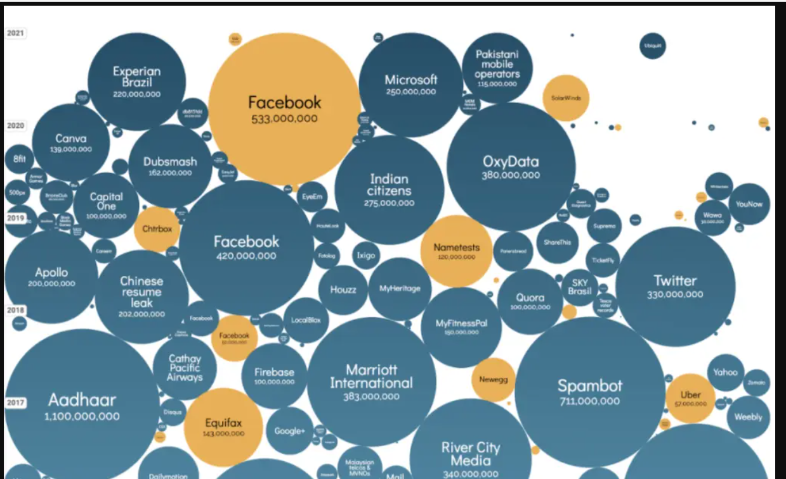

This is a visualization of all of the data breaches over the last 18 years. This is a very interesting graph, because when we usually see a timeline it is in a horizontal setting, but in this case this timeline goes vertically down. So the top is 2022, and one down is 2021, 2 down is 2020, and so on. It is also cool that the circles correspond to the amount of records lost. If the number is higher, then the circle for that company/organization is bigger.

My favorite part of this visualization is that when you hover over it, it gives us more of a background and tells us more about the data breach for the company. For example, Facebook lost 533 million records for 533 million users. They lost address, phone number, email record, etc. Capital one lost 100,000,000 records as well. I think this visual is better than a straight bar chart over time (I would have done this), because it really allows the user to understand what sort of data breaches occur. Because if you just looked at a simple bar chart, we could see which companies are dealing with this more, but we won't understand what kind of data breaches are occuring.