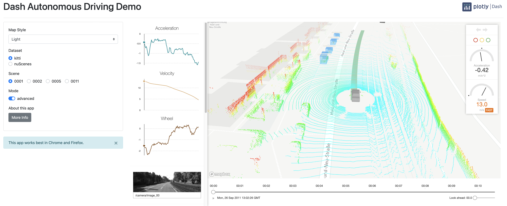

While learning about Python plotting tools, I discovered Dash+Plotly, a data visualization framework to quickly create fast and interactive in-browser visualizations. One of the sample visualizations was this Dash Autonomous Driving Demo.

I think this data visualization is very interesting. It uses mapbox to show a base map with streets and buildings. The mode (light, dark, satellite) can be toggled through a dropdown menu. Moreover, the visualization allows changing scenes and datasets. Toggling the advanced mode brings real-time plots for acceleration, velocity, and wheel (?), in addition to a camera view. At the bottom is also available a timeline bar to see second by second the sensor fusion overview.

I think this visualization is very powerful. It allows to see what the machine could and could not detect. It provides both a video and sensor overview of the car, with details on the instant velocity and acceleration. The ability to view the satellite map as well is great to cross-check or compare the landmark with the car's sensors.

I think there are a few bad things with this visualization:
- First, the performance isn't great. The visualization was so intensive that my browser suggested closing the tab. I think some preprocessing or optimization could help incredibly.
- Second, there are no units of measurement on the plots, making it difficult to interpret some plots.
- There is no legend. It's difficult to understand what the colors refer to.

