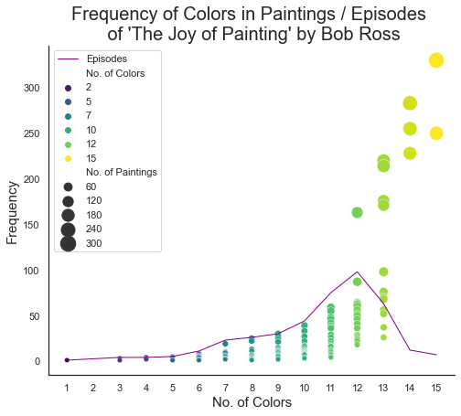

link: https://www.reddit.com/r/dataisbeautiful/comments/st7035/oc_color_frequency_in_the_joy_of_painting_by_bob/

As an avid Bob Ross fan, this data visualization piqued my interest. This visual was created using the colors used by Bob Ross in his 'Joy of Painting' television series. The graph shows the frequency of color used in his paintings. The purple line represents the number of colors used in each episode of the television series and each dot represents each specific combination of colors used. The size of the dot represents the number of paintings this combination of colors can be used for, and the color of each dot represents number of colors they contain. Overall I found this visual quite difficult for me to understand. I looked at it for quite a while in an attempt to understand what the number of dots under each number of colors means. I think that this visual just has too much information trying to be displayed in such limited space. There are so many different colors, sizes, and lines which makes it confusing. I think that this could have been simpler if the author separated some of the data into different charts and graphs. It might be difficult to understand because both the line and the dots are vertically stacked, which makes it very overwhelming. I also find it odd to believe that 15 colors can be used to make 300 different paintings but I might be reading this graph incorrectly due to its confusing-ness.
