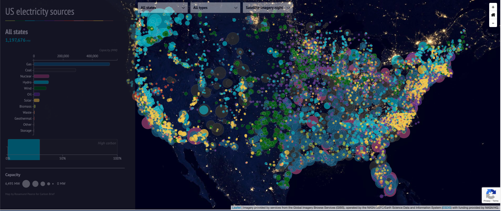

Source: https://www.carbonbrief.org/mapped-how-the-us-generates-electricity

For this weeks reflection I was looking into electricity on the United States level. This data visualization that I found looks at the electricty sources that are used in different parts of the United States. The different types of electricity sources that are shown on the map are gas, coal, cuclear, hydro, wind, oil, solar, biomas, waste, and geothermal. The map uses a google map like system with zooming in and out features to look into a specific state or cities electricity types. However on the bottom right of the map it says that the Imagery was provided by services from the Global Imagery Browse Serverces, which it says is operated by NASA. Which makes sense since the map looks like it was taken from space at night. The map also shows the size of how much of a specific resource is used in a state/city when you zoom in. 

I would be interested to see other parts of the world if they were to make one for every country. That data would be useful for people doing research in this area to compare and constrast different contries electricity sources. From looking at the map of the United States it looks like the east and west coasts have more solar and solar electrity powered. While the mid-west has more wind and gas electricity sources. In the article down below the visualization they show a group of different simulations and visualzations. The most interesting one to me is that they show the electrity different from today and 10 years ago. They also show another very interesting graph of eleectry usage from 1960-2017 with all the seven different types of electricty. 

