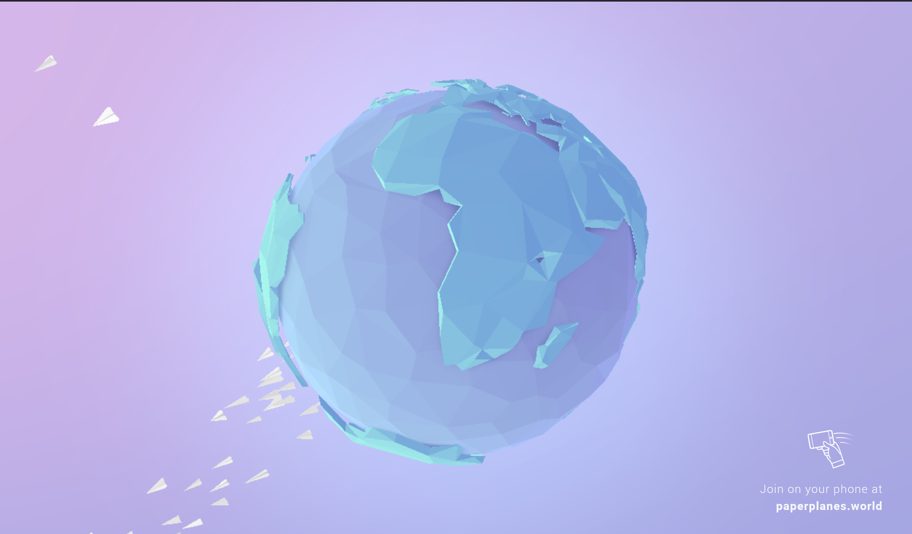

Paper Planes Around The World
==
Website: https://paperplanes.world/

This website is an interactive visualization of people "throwing" paper airplanes around the world. The base of layout of the website is a visualization of earth with a swarm of airplanes circling.

I found this layout really engaging to look at and watch. When a plane is thrown there is an animation to the location on the map with the location shown on the earth.

I though it was a really good design for how the location on earth was visualized with a radar ping. This website is more pf just a creative endever and doesnt really show any useful data but it's really fun to interact with.