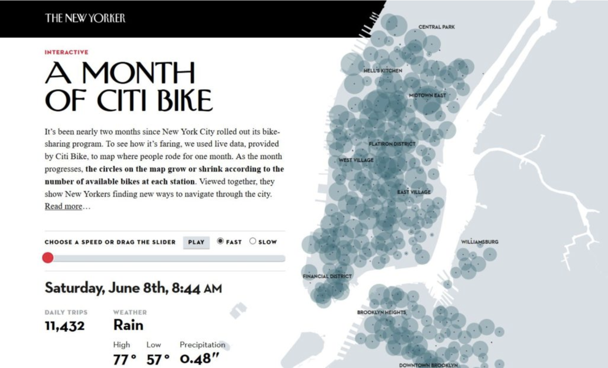

Source: https://projects.newyorker.com/story/citi-bike.html

For this weeks reflection I was looking into a New York City data visualzation maps. The data visualization that I found is about the citi bikes within New York City. The data visualization specifically looks at the use of the citi bikes in the New York City area from central park to lower manhattan over the period of a month. Specifically it has a a scroll bar with a red circle that you can go to any day within the month and it will show you the current number of citi bikes on the map. You can also press the play button in which it will do slow or fast animation through all of the number of avilable citi bikes at eachs station during the day and the night. 

The website which is the newyorker.com also tells you in depth information about the 
the specific time of day the red scroll bar is over. It tells you the daily number of trips that the citi bikes had for that day and it also displays the weather for the day. The weather is definitely a very good implementation in this situation becuase it tells the reader/viewer about the number of daily trips all of the citi bikes had. Becuase it it was a rainy day not as many people would use the bikes unlike if it were day time a lot more users would be using the bikes. When you also scroll or animate the red bar it shows you the time of day in a visualization sense. It shows this by making the background color white for daytime and dark for nighttime. 

