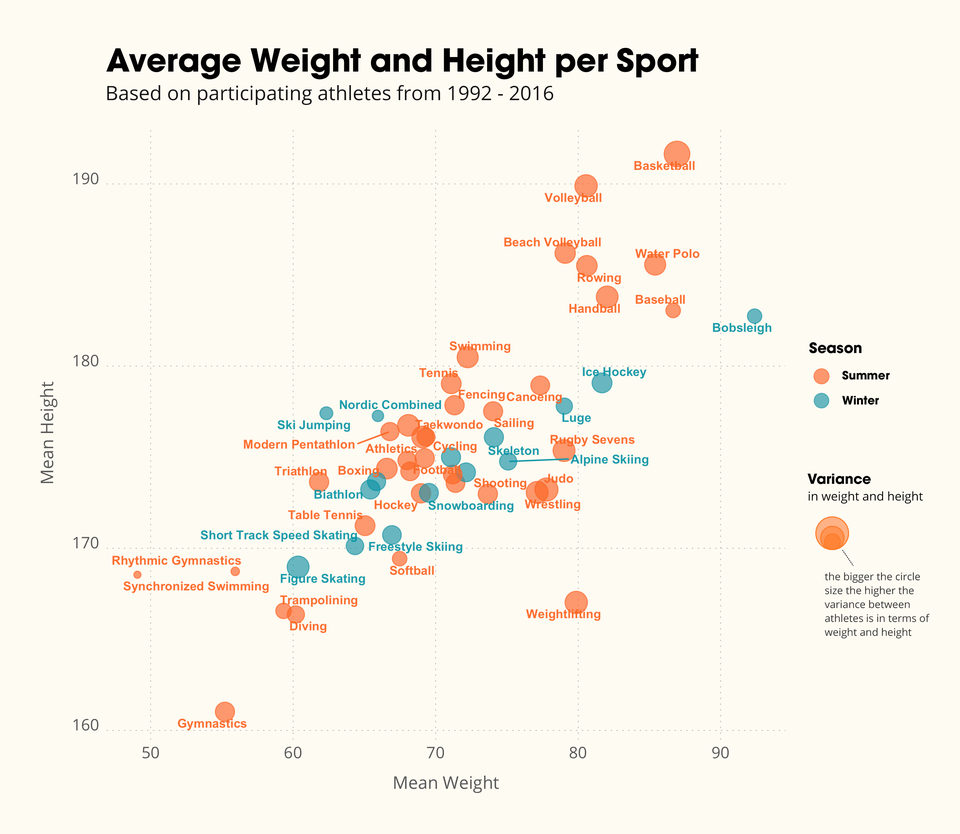

link: https://www.reddit.com/r/dataisbeautiful/comments/sm20ir/relation_between_height_and_weight_per_olympic/

With the Winter Olympics happening right now, I found this data visualization to be really interesting. This graph depicts the average height (in cm) and weight (in kg) of Olympians from the Albertville 1992 to Rio 2016 games. This data is also broken down by Olympic sport and by whether the event is a winter or summer event. Also in this visual, the size of a dot represents the variance in weight and height within a sport, meaning a bigger dot the bigger the differences in height and weight per athlete are. I found it particularly interesting how there were a few sports, such as rhythimic gymnastics and synchronized swimming, that there is very little variation between the height and weight of its athletes. Additionally, I was surprised that basketball had the tallest and heaviest players, compared to sports such as wrestling and boxing (I would think these athletes would be the heaviest). It seems that majority of Olympians are between 60kg and 80kg and between 170cm and 180 cm tall. To improve this visualization, it would have been more helpful if the creator included units for each measurement because it might not be clear to people who aren't used to the metric system. Also, some of the sport names are really clustered together so it is difficult to determine which dot corresponds to which sport. I would have also liked to see the chart broken up by sex, since males tend to be taller and in turn more heavy than females. It also could be cool to see this further broken up by the athlete's home country. After looking at the data set that was used to create this data visualization, I would also be curious about old Olympic sports that might not be competed anymore such as Tug-of-War (data permitting). 
