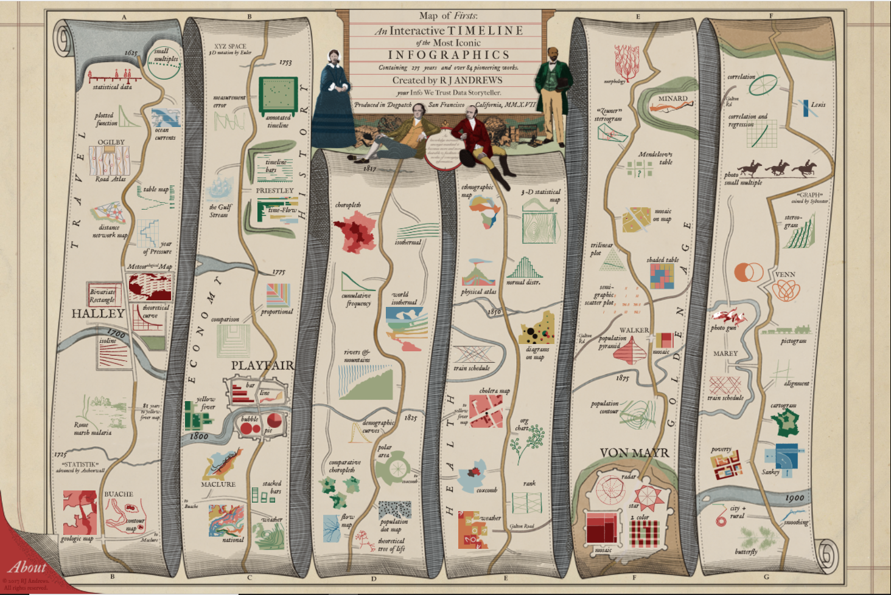

Click on picture to go to link.

For my week 4 visualization, I decided to look at an infographic by RJ Andrews chronicling the history of data visualization. 
This graph is read read in chronological order from top to bottom then left to right. 
I was initially drawn to this graph because I was looking at various Minard graphics and was hindered when I couldn't read French. 
By looking for an explanation of his graphs, I eventually came upon this website. 
What struck me about this was how pretty it was and the specific style. 
Often times in modern infographics, everything looks very sleek and rounded; however this was very much embellished and artistic. 
What was really cool was that each of the visualizations could be hovered and clicked on to learn more about the visualization. 
Although the graphic was a good surface level representation, the way it was presented made it hard to see any connections between the various innovations in visualization. 
I think maybe a tree could have done better. 
Also, the labels didn't really categorize any of the areas, so they felt slapped on rather than representative. 
Lastly I wish that one could see a hover or interactive version of each visualization rather than just a picture.
