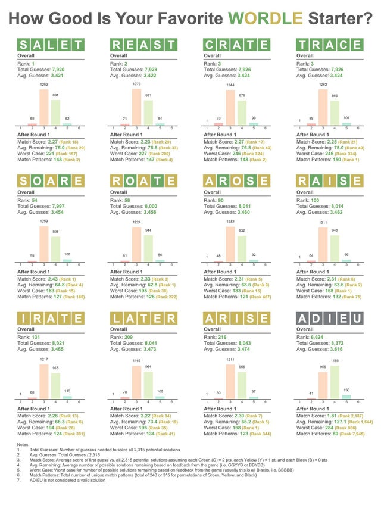

link: https://www.reddit.com/r/dataisbeautiful/comments/sgc5g6/oc_how_good_is_your_favorite_wordle_starter/

As a recently avid wordle player, I am constantly looking for ways to improve my strategy and beat all my friends. This visualization depicts the best 12 starting words in the game wordle, based on the word's match score (average score of first guess vs. all 2,315 possible solutions, assuming each green is 2 points, yellow is 2 points, and black is 0 points), average remaining (average number of possible solutions after feedack from the first guess), worst case (worst case for number of possible solutions remaining based on feedback from the game), match pattern (total number of unique match patterns). To accomplish this, the author used a decision tree with optimizations to prune branches that were extremely unlikely to be optimal. The ranking is based on the least number of total guesses required to solve all 2,315 valid solutions. I found this visual particularly interesting because in the past I have based my first guess after the most common letters that appear in 5 letter words (I use 'tears'). I took an artificial intelligence course at WPI last year and am familiar with the minimax pruning algorithm, so this approach seems much more doable programmatically. I'm curious to see how the top word 'salet" works as a first guess. I'm somewhat skeptical how well this will work (since none of the letters would be a match for today's wordle # 239). It might be interesting to collect data on this from a human standpoint guessing, since the pruning algorithm is very different from how a human brain would think in the moment. A lot of people have commented that they try to guess most of the vowels first and going from there. I'm curious to see if there is correlation between how good computer guesses are and human guesses. Perhaps there could be some type of study similar to my data visualization MQP for guessing words? I've also seen that cleat followed by irons is a good first couple guesses to get the most commonly used letters in. 
