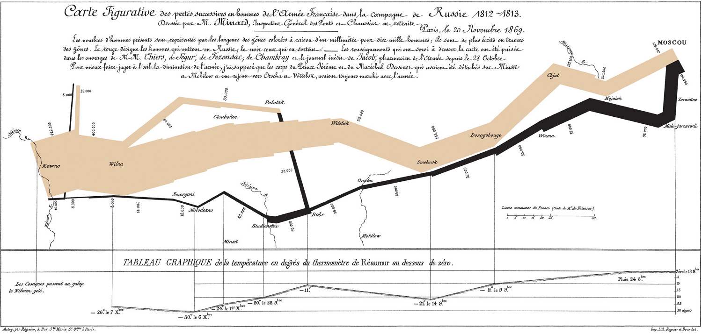

 

My Week 5 visualization, inspired by our focus on maps last week, is on Minard's famous visualization of Napoleon's invasion of Russia.
This visualization communicates 6 different channels of data, the number of Napoleon's troops, the distance traveled, temperature, latitude and longitude, direction of travel, and location relative to specific date.
The location (latitude and longitude) is shown by the path drawn over a map with respect to several major landmarks.
The troop number is showns by the width of the path.
The distance traveled is shown by the lengths of the path and the legend in the bottom right.
The direction is shown through the color of the path, with the lighter color being the army advancing, and the darker color the retreat.
This channel of information is particularly interesting, because it is never explicitly stated but to anyone who knows the story of what is being visualized the meaning is clear.
And finally temperature is shown in a line chart at the bottom.
Rather than the x axis representing time it represents the longitude of the army, with lines drawn to the location the temperature was recorded at.
The dates are explicitly labeled under each reading.
Temperature is only shown in relation to the retreating path, a choice that makes sense as both visualizing both directions would lead to overlap in the graph as longitudes were traversed by the army twice, and because the temperature was most relevant on the retreat, when winter took its toll on the army.
