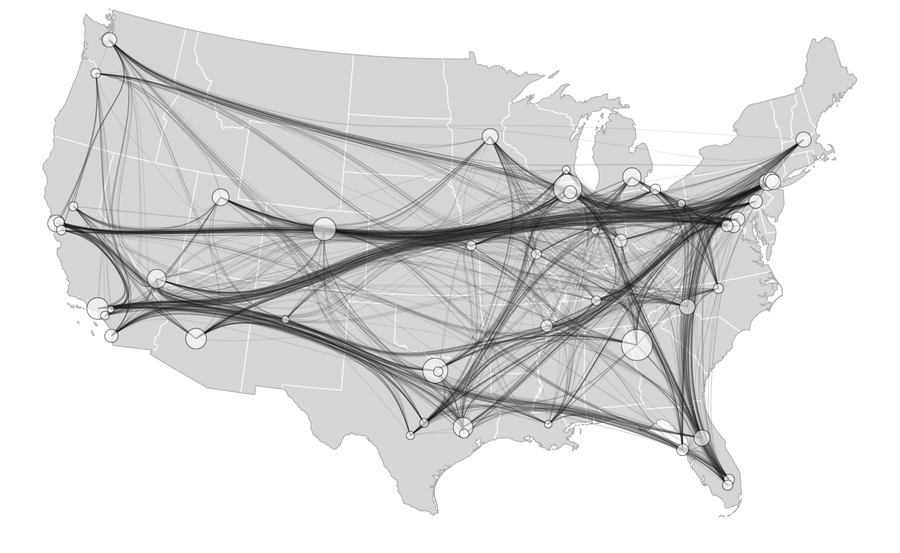

Link: https://bl.ocks.org/sjengle/2e58e83685f6d854aa40c7bc546aeb24
Link (Airport Symbols Map): http://mbostock.github.io/d3/talk/20111116/airports.html

This visualization uses edges to show flights between different airports in the continental US. This visualization only shows larger airports in the US. I would add more airports because many of the large airports go to almost all other major airports, but many people don't know where the other airports fly to. By doing this, you can also compare how many locations small airports fly to compared to large airports. The description of the visualization does say that the chart can be extended to show the top 50 airports by degree or the highest degree airport by state. I would also include Hawaii and Alaska to give more information, especially Hawaii because it's such a popular vacation destination and there are a lot of flights in and out of the state. Some positives about the visualization are that the movement of the edges catches the users eye. The curved edges is more aesthetically pleasing compared to the straight curves on another chart called Airport Symbols Map. Lastly, when you hover over an airport node it will highlight the edges that are connected to that airport so you can easily see them. This is useful when you want to see what locations that airport flys to and from.
