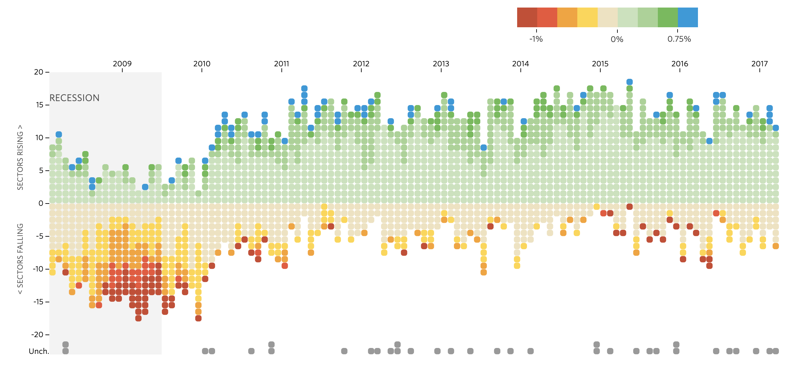

Source: http://graphics.wsj.com/job-market-tracker/

For this weeks reflection I was looking into job market gains and losses in different years. The one that I found was on the wall street journal before Covid-19 was a thing. We can easy see on the map that during the years of 2009 to 2010 the job losses were not the best becuase the unemployment was very low. Then as the years progressed towards 2017 the job gains got much better. However if it were to show the years when covid hit then I beleive that the job unempolyment rate would be very low and the worst it has ever been since the great depression. However I think the graph does an execlient job in showing the data very cleanly to the user. 

This graph visualization seems easy to make since it just shows the percentage of employment/unemployment in a specific job sector in the last eight years. You can also hover your mouse over the circles in the specific month of the year to see a more in depth details about each circle which will show the speicfic job, the percentage, and which month/year it is. There is also some interesting information at the very bottom of the graph that shows which jobs have no gains or losses over the years. They show this in grey which I beleive is a very good color to show data that doesn't change over the years/months. They also scale the data percentage from dark red to blue when showing the percentage which is nice when showing the percentage of job change. They also show a legand of this at the very top of the graph to show the user.

