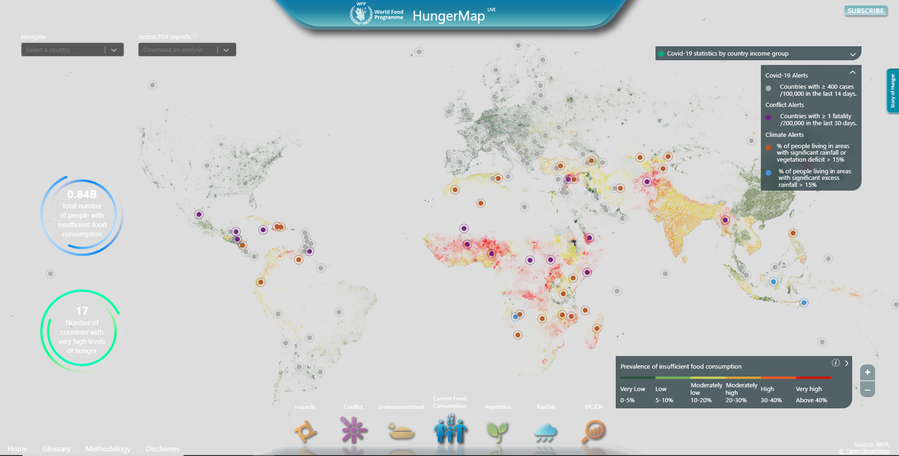

Click on the image to view the interactive version.

For my week 5 reflection, I decided to look at the United Nations World Food Program HungerMap. 
This interactive map primarily shows the prevalence of insufficient food alongside other factors like rainfall, hazards, vegetation, and conflict. 
In addition to showing these metrics which can be filtered by country, you can also download reports about the data as a pdf from the same site. 
Overall, I feel like this visualization is very data rich; however at times I think it can be overwhelming. 
On top of all the data, extraneous summary statistics are surrounded by a moving circle which draws you attention away. 
These are impactful statistics, but because they are white against a light grey background, it is hard to read. 
The pulsing dots represent other factors in the region, but I feel like their pulsing again detracts. 
All of this is only on the initial landing page, but each new view selected from the bottom feels like a whole new interface that needs to be learnt. 
For instance, undernourishment pulls up a static image while hazards and conflicts can be toggled over either current food consumption, vegetation, rainfall, or IPC/CH. 
Although the legends are helpful, there are no instructions on how to use the buttons, so I could easily see someone getting lost and giving up. 
Additionally, these legends use a lot of jargon, so they are not accessible to the average person. 
Another cool feature is that you can select individual countries which pulls up a sidebar with country specific statistics. I though this was more helpful since it also shows hunger data over time.
In conclusion, I think this visualization is very useful, but it is stuck behind a high learning curve and data density.
