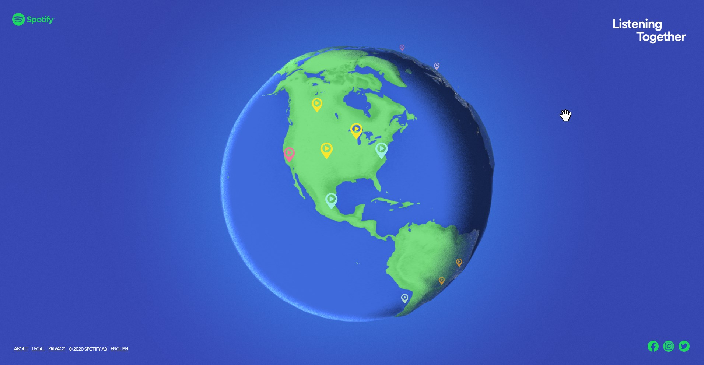
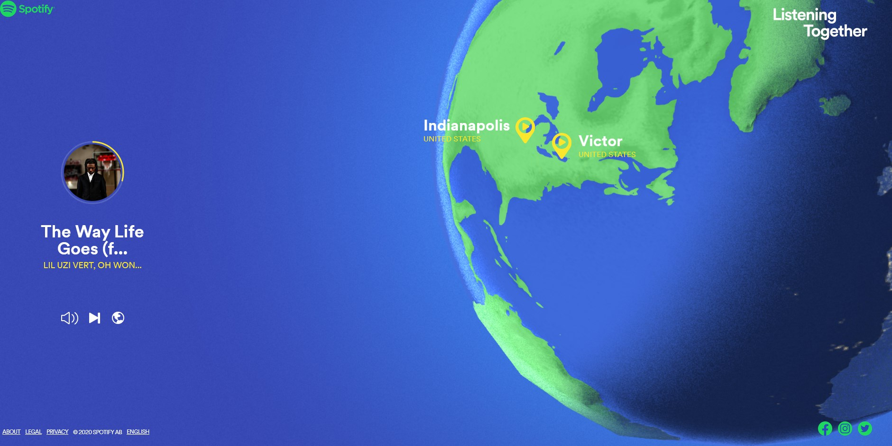

Listening Together
=====
This is a visualization of spotify users who started playing the same song at the exact same time around the world. The base display is a 3D model of earth that has pins all round the globe.  

The pins are color coded in which 2 pins of the same color are the locations of the users listening to the same song

You can click on the pins to see what song is playing, this will play a clip of the song as well. I found this visualization  really interesting  just due to the amount of people who start listing to the same song at the exact same time.