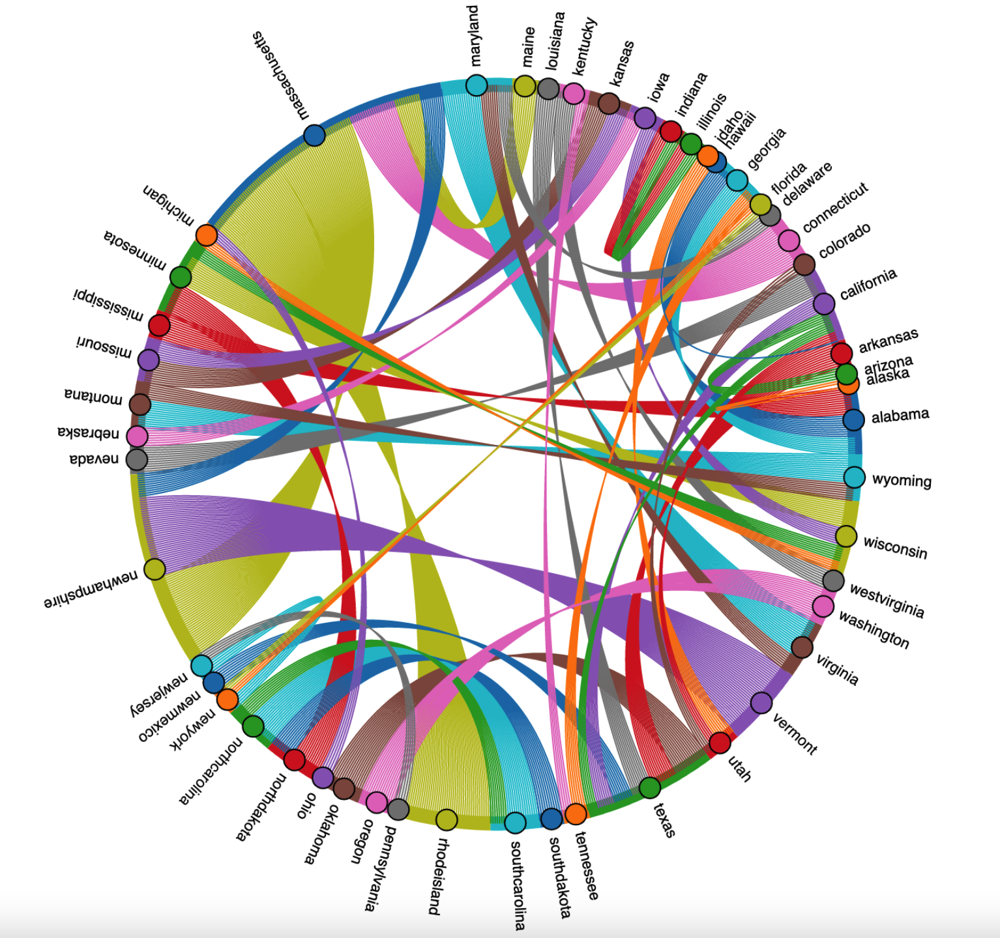

Link: https://www.reddit.com/r/dataisbeautiful/comments/sccst3/oc_states_that_talk_about_each_other_the_most_on/

This data visualization shows which states mention each other the most on Tik Tok using edge building. I think this is an interesting visualization because it is so relevant in today's world. It can really show a big picture of how the people all over the country communicate with each other through social media. You can see many geographical patterns with this diagram. For example, every state that is near another state always has an edge connecting them. All of the New England states have an edge between at least one other New England state. The edge of the circle is where the states are located and the amount of color for a state represents how often a state is mentioned. This is an easy way to see which states are mentioned more or less often and you can clearly see that MA is mentioned the most of all other states. One thing I would change is not repeating the same colors for multiple states. When two edges of the same color cross over each other you can't really determine which edge goes where and it gets very confusing. I would have also made the diagram larger if possible because some states on the edge of the circle who don't get mentioned often are barely able to be seen. One thing that was hard for me to interpret on the diagram was an edge that separated into many individual lines when then reached a state. I think this shows that if two states mention the same state you can see if one state mentions that state more that the other. For example, VT and MA mention NH most often, but the edge coming from VT is much wider so that shows that VT mentions NH more than MA. Another issue with this type of edge building diagram is that it is hard to follow an edge from one node to another because that are so many edges that are crossing over each other in the center of the circle. 
