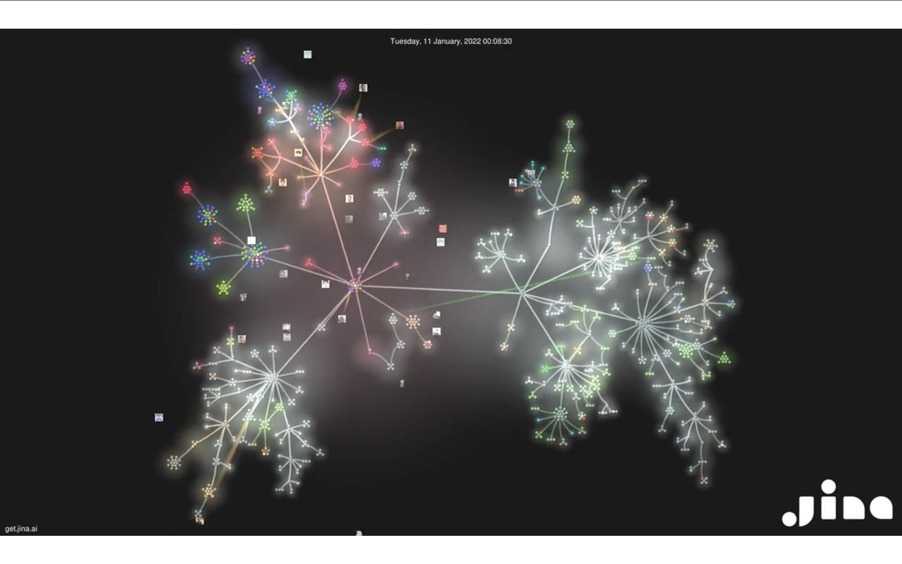

This data visualization shows the activity on the Jina GitHub repository. The video shows a graph data visualization with branches and contributors.

I think this data visualization is really nice. It displays data over time of the contributions to a GitHub repository in a very visually appealing way. The entire visualization also looks like a light show.

At the same time, from a formal perspective, I think there's many issues with this visualization. First, I am not sure what the colors represent. Second, some contributors have lines that connect them to branches, but I am not sure what the lines represent. Although it's not a formal visualization, I think there should be some kind of a legend. Another confusing thing is the circles. I imagine each branch is a circle, and that each group if circles is branches that are based on each other.

Overall, I think this is a really good visualization that gives you an idea of the scale and activity of the project, as well as the scale of the contributor base. I wish it was more intuitive or understandable, or that it had a legend.

https://www.reddit.com/r/dataisbeautiful/comments/sxipyn/oc_beauty_in_chaos_2_yrs_of_activities_on_an/
