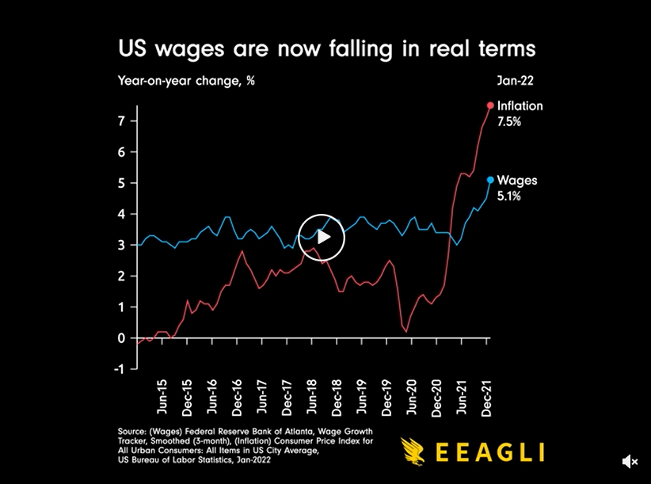

link: https://www.reddit.com/r/dataisbeautiful/comments/suqj9n/oc_us_wages_are_now_falling_in_real_terms/

Recently I have noticed the cost of everyday items have been increasing at an alarming rate, which is why I found this data visualization particularly interesting. Using wage data from the Federal Reserve of Atlanta and the US Bureau of Labor Statistics, this visual shows the change in wage vs. inflation from January 2015 to December 2021. For most of this time period, the wage increase is higher than the rate of inflation. Mid 2021 the rate of inflation surpasses the rate of wage change, which is frightening for me to think about considering I will (hopefully) be entering the work force soon when I graduate. I think it would be interesting to see this data further broken down by other demographics, such as race, age, income ranges, etc. which could give us more information behind the trendlines we see in the visual. It is also fascinating to see how inflation played out at the start of the pandemic to now. Perhaps the change of inflation surpassing wage in mid-2021 could be attributed to the pandemic and the closure of many businesses and services. I'm curious to see if the spike in inflation improves now that covid-19 cases are starting to drop and if the economy just needs time to recover. Someone made an interesting comment that "you have to account for the fact that these are using average wage. When we entered the Covid recession, this statistic skyrocketed. Why? Because all the people laid off by Covid were lower paid. So the average hourly wage went up a ton. Those people getting rehired then brings the average back down. It's a hidden source of error that makes tracking month to month of this stat misleading." This also could be reasoning behind the increase of inflation since businesses such as restaurants are starting to open back up and servers tend to have lower wages due to tips. I think that this data could be really interesting to examine by different demographics and populations!
