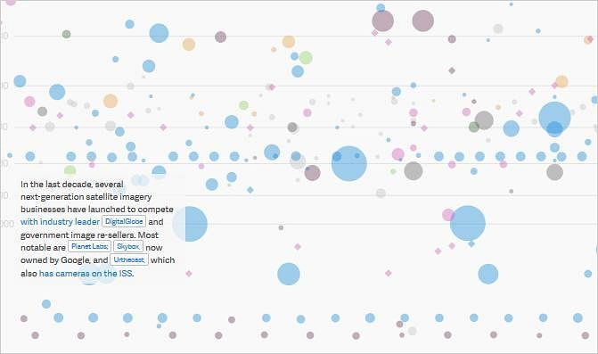

Link to the Interactive Version: https://qz.com/296941/interactive-graphic-every-active-satellite-orbiting-earth/

This is a visualization of the 1200+ satelites that are orbiting the earth. This visual is interactive, where the user can hover over the circles/diamonds and see which countries own the satelites and what purpose they serve. We can also see the information about which satelites orbits are furthest and closest to the earth. Also, since this interactive visualization has color codes corresponding to the country, if a user wants to see which China Satelites are the furthest from the earth, they can easily do this because of the structure of this visualization. I also think it is very intiutive and interesting that the visualizations also has short paragraphs in the visualization. This helps the audience grasp important ideas from the visuals which they may have missed because there are over 1200+ satelites.

The next part of this interactive visualization was allowing the sattelites to move in their normal orbit distances. This is very interesting because it shows which orbits stand more pact and which ones tend to move a lot. I think this is an interesting addition, because maybe the users that aren't to familiar with space may not know how much these satelites really move, so it gives another dimension of clarity for the audience.

I think visuals like this should be continued to be used in the future because it is extremely difficult to make a 100% perfect visualization with 1200+ satelites because there is so much information to unpack. But this visual allows the User to grasp the information they want to by hovering over the satelites they want to observe, but with the text boxes, it allows the user to gain the most important ideas.
