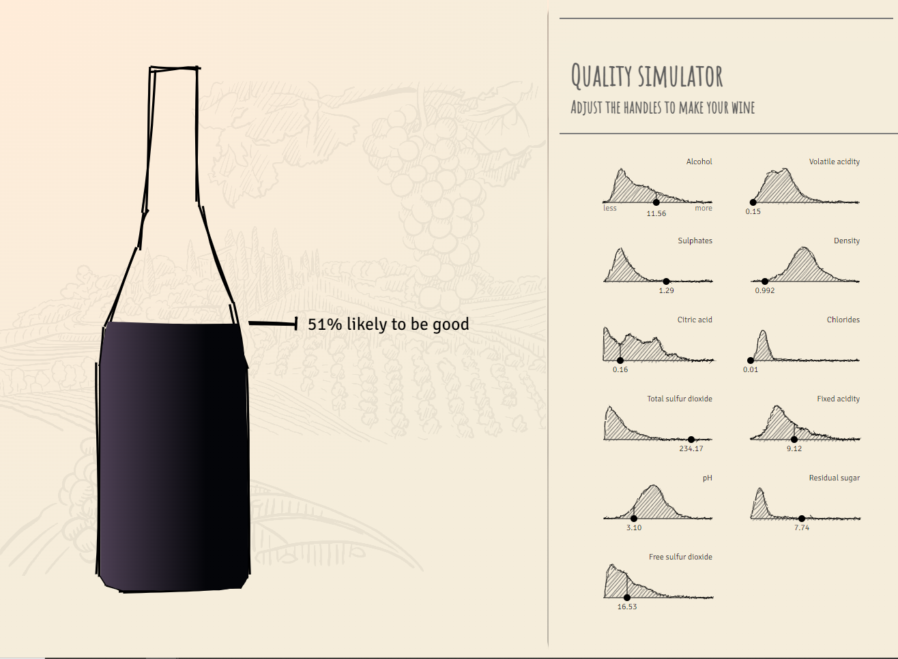

Click on the picture to view the interactive version.

For my week 6 reflection, I decided to look at this wine visualization that tries to explain machine learning techniques by visualizing each and taking a reader through a story to predict the quality of wine. 
I really like how this article walks you through each step from data exploration all the way through prediction. 
The handrawn art style and color palette is very relaxing which makes the complex topic seem approachable unlike other "slick" visualizations that seem pretentious or clinical styles. 
Even the histograms were in this style as the curves made the data look more like a cloud than a clear cutoff. 
The other aspect that enhanced the experience was the scrollability. 
This made it seem like a story rather than a slide deck. 
After each bit of text, the visualization changed which kept me engaged throughout the entire experience.
Lastly in the end, there was the interactive portion. 
I thought this brough together my understanding since it incorporated everything previously and allowed your input. 
I thought the wine sloshing added character rather than just moving the level. 
Overall, I though this was a very artistic visualization which helped make machine learning more approachable.
