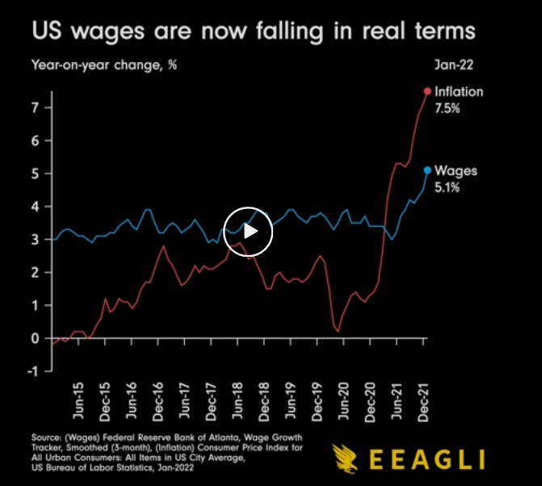

# Reflection 6 - Wages vs Inflation

https://www.reddit.com/r/dataisbeautiful/comments/suqj9n/oc_us_wages_are_now_falling_in_real_terms/

I thought this was an interesting visualization given how inflation has been increasing and how we are having a labor shortage.
It's really interesting to see how the inflation grew a lot as Joe Biden took office it seems. And this is not a political reflection by
any means. I'm genuinely curious as to why that happened. In fact, I'd love to see this chart in years where other Democrat presidents were
in office. It just seems like everything gets more expensive, when a Democrat is in office. Even things like gas. Anyways, line graphs
are one of my favorite graphs because you can really see how data changes of time. In this case the video shows an animated graph which is
even better. I thought it was also interesting the color choices the designer made for the two lines. The inflation line is red while the
wages line is blue. Naturally I think of red as evil and blue as hero. You know Star Wars and such. Haha. 

-Matthew Aguiar
