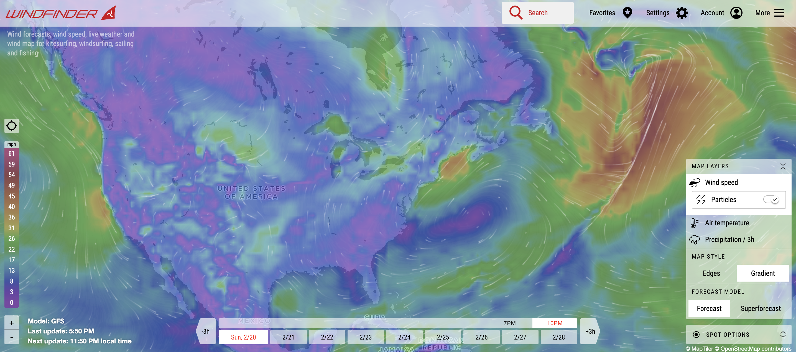

Source: https://www.windfinder.com/#4/41.9350/-77.1680/nospots

For this weeks reflection I was looking into wind data visualizations on a global perspective. This data visualization was very interesting in the sense that you were able to see the current wind speeds anywhere in the world. You can also see the current wind directions by looking at the curved white arrows. You can see that most of the arrows go around in circles in different parts of the world because of the different wind patterns around the world. The map also shows different temperatures around the world. It also scales the speed of the wind from purple being the slowest and red being the fastest. These values differ around the globe depending on the current wind speeds in different areas. 

The map also has a very nice interactive feature which is that you can press on different parts of the map to see more detailed information about the wind speed/direction and also where you on the map with latitude and longitude information. The map information also seems to update every 5-6 hours. There are several different options that you can do with this data visualization like making the arrows be animated or static. And there are three major map features that you can do which are changing the map layers wind speed, air temperature, and precipitation. Overall I beleive this data visualization is very informative to the user since it shows useful data very nicely for the user to see. 

