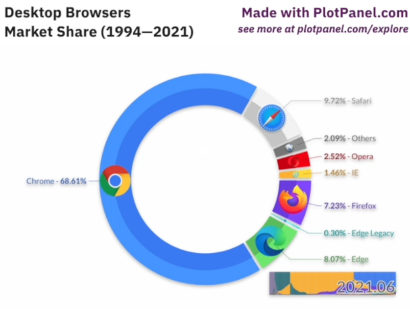

# Reflection 7 - Browser Market-share

https://www.reddit.com/r/dataisbeautiful/comments/t1unxv/oc_desktop_browsers_market_share_1994_2021/

This is another animated donut chart showing how web browsers changed over time. I have been told that these type of charts are not
as informative as other charts but I think it does a really good job of showing how browser usage changed. Especially because it shows
the actual percentage market share next to each slice of the donut. Overall the chart is very clean and clearly shows how browser
market share changed from 1994 - 2021. I was born in 1999 when Netscape was fading out and IE was rising. I do distinctly remember using IE
when I was young and then we all started using Google Docs with Google Chrome in 6th grade. We never looked back! Now I actually use
Firefox because they don't collect data like Google does. There was also a time in 2012 where it seemed that IE, Firefox and Chrome
shared almost an equal share. However, today Chrome has the majority 67% share. I do worry that some tech companies are getting so powerful
perhaps too powerful. Companies like Alphabet, Microsoft, Apple, Amazon and even Meta. It'll be interesting to see how they shape our future
in technology.

-Matthew Aguiar
