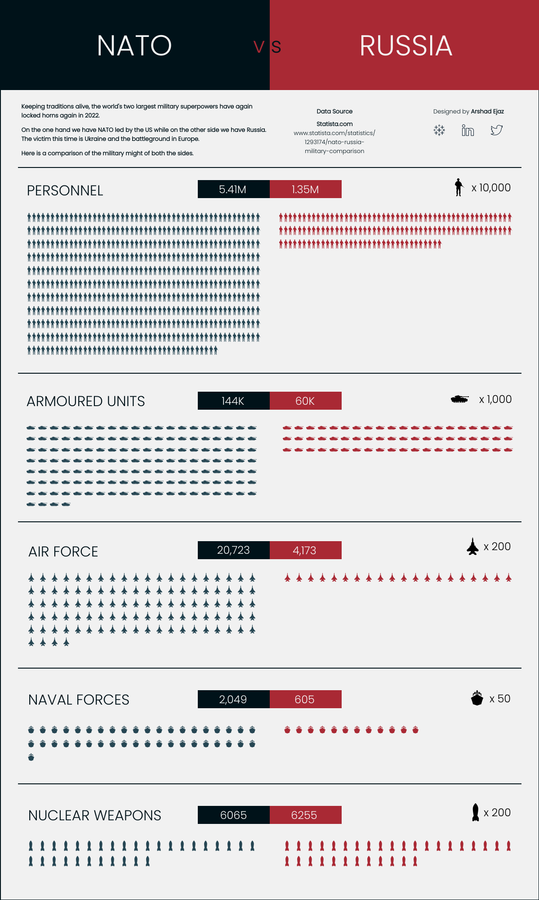

This data visualization shows the difference between the NATO and Russian military force.

I think this way of visualizing data is really impactful. Without using numbers, nor plots which can be misleading, this visualization shows the difference between the two military forces. I really like the design. It uses symbols to visualize numbers, provides numbers in case one is curiousof the magnitude, and a color friendly palette.

Something I am not a fan of is the possibility of misleading people with bad scales. For example, for nuclear bombs, 1 symbol could indicate 500 bombs. If the two countries were off by only a couple additional weapons, or by 500, it would be shown with just 1 symbol. This can definitely be misleading.

I appreciate that this visualization includes sources and authors as well. However, based on a comment, this is not just NATO military forces, it's also the combined military force of all NATO countries. This is of course different, and it's not mentioned in the poster.

https://www.reddit.com/r/dataisbeautiful/comments/t2xs7q/oc_a_comparison_of_nato_and_russias_military/
