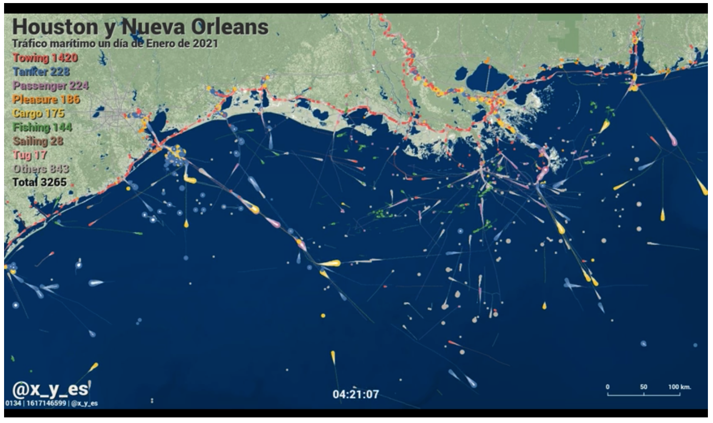

Link: https://www.reddit.com/r/dataisbeautiful/comments/szndao/maritime_traffic_in_the_ports_of_new_orleans_and/

This visualization shows maritime traffic in ports in Houston and New Orleans in one day. I think this is a very informative visualization that tells you how many boats are going in and out of each city and it shows you what types of boats. I think this would be important if you were doing research on topics related to boats/ships, such as imports and exports for each city. I like the shape they used to represent a ship because it informs the user on which direction the ship is going by having a tail the drags at the end of it. The markers also vary in size depending on the size of the ships. This give quick and easy to interpret information on the ships. Some things I would add are being able to hover on a ship and its path to highlight them and see more information about the ship like its origin and destination. As soon as a ship leaves the frame you don't know where it's going. I do like how there is a thin line that follows the ship to show its path and that it doesn't over crowd the visualization. I would have also made the map of the cities more informative like adding smaller city names within the large cities and highlighting the roads to make them stand out more. There are many boats in this visualization that are on land and most of them are being towed. For people that don't know these two cities very well, it would be useful to have more descriptive maps of them. 
