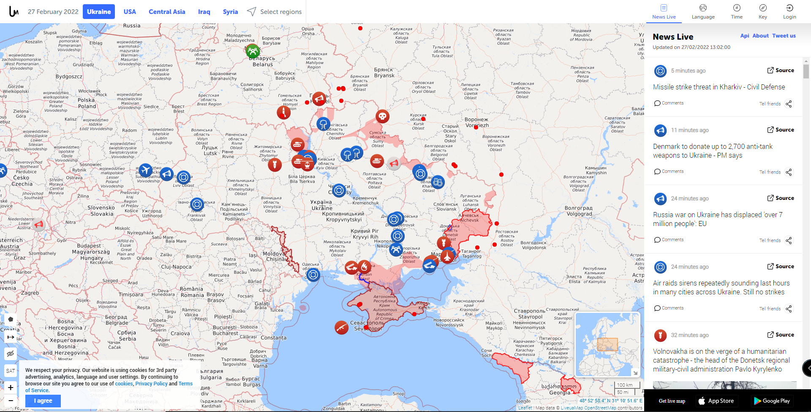

Click on the photo to view the livemap.

For my week 7 reflection, I decided to do a map of the Russian invasion of Ukraine.
Although I have done maps in the past which I think are better from a technical and design aspect, I think that this map is both powerful and relevant.
The map shows areas of Russian invasion and occupied areas in red as well as Ukrainian troops in blue.
This color schme plays to Russia as the agressor.
In addition to just showing a territory map, a key feature of this map is that it links to a social media feed and shows the location of those events on the map.
One can click on an icon and be taken on the website itself to the video, photo, or tweet.
Compared to the hunger map reviewed two weeks ago, I think this is a lot more effective because it is prominently displayed.
Often times in charts, it can be hard to see the human impact, so being able to see photos and videos directly without having to go to a new site contextualizes the map on an emotional level.
Another featur which I think is very cool is the ability to see the map at different time points.
For instance at the beginning of the invasion, there were a lot of red Russian icons, but now there are more blue icons which could represent the mobilization of Ukrainian troops.
Despite this map's simplicity, I was drawn to it because unlike other sites, it seamlessly combined both troop movement, occupied areas, and personal stories into one cohesive presentation.
