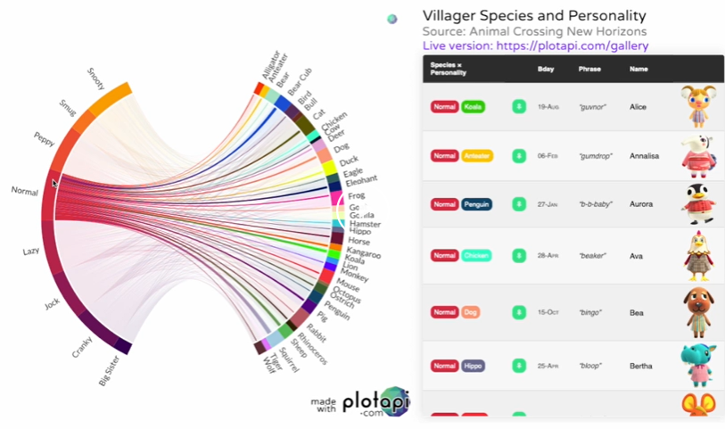

link: https://www.reddit.com/r/dataisbeautiful/comments/qmnrte/oc_animal_crossing_v20_update_personality_and/

As an avid animal crossing player, I found this data visualization particularly fun and interesting. It is a chord diagram created in Python with the PlotAPI. It shows the different types of animal crossing villagers (dog, bird, frog, etc.) and the different types of personalities (snooty, normal, peppy) and their relationships. In the interactive version, you can click the different types of personalities and see what types of animals those villagers are, or you can hover over individual lines to see villagers that are a certain personality and a certain type of animal. I've seen pictures of these types of graphs/visualizations before and didn't understand what they meant/how they worked, but the video on this reddit page makes it very simple for me to understand. I also like the use of different colors that make this visualization appealing to the eye, but all the different lines unless a user hovers over one is a tiny bit overwhelming. It is unclear where the person who made this got their data from, but I think it might be interesting to see the different villagers that are for different games. Perhaps they could add a drop down setting where the user can select an animal crossing game such as new leaf or new horizons and the graph would display the types of villagers that are included in that game. I think it would also be helpful to highlight the type of animal that has the most characters for a given personality so if someone was trying to look for a villager with a certain personality they could see which type of animal they should look into. I would be interested to see how to make a graph such as this one code-wise in Python and hope to make one in the future.
