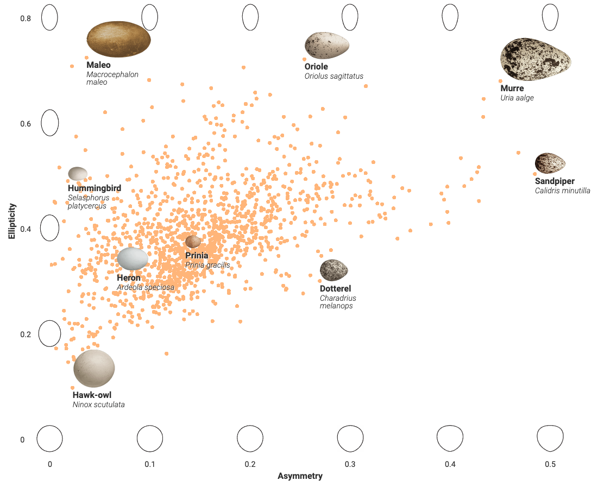

Source: https://vis.sciencemag.org/eggs/

For this weeks reflection I was looking at animals and different kinds of evolutionary data visualizations. The data visualization that I decided to go with was looking at eggs and their shape for different types of birds. The website sciencemag had scientists analyze different egg shapes from 50,000 bird eggs. This took the scientist roughly 100 years to collect data from the birds. When the scientists are analyzing these bird eggs they had to look at the diet, body mass, number of eggs in a nest, location, nest type, and the birds flying habits. With all of this data the scientist were able to make this great data visualization to show all of the data in a great way to making it easy for the viewer to understand.

Looking more in depth at the data visualization we can easy see that it just a simple scatter graph to start but with some really nice features added to make it easier for the viewer to understand. So for the x axis is the asymmetry and for the y axis is the ellipticity. With this we get all of the orange points on the scatter plot which displays each bird. The ellipticity axis of the graph shows the ellipsoid of the revolution for the egg respectively. The Asymmetry axis of the graph shows how pointy the eggs are. With all of this combined into the graph it shows all of the different eggs plotted and in a very good manner. The graph is easy to see how rare pointer and small eggs are and then how big and pointer eggs are more common. Overall I think that sincemag did a great job in showing the data and presenting it in a great way for the viewer. 

